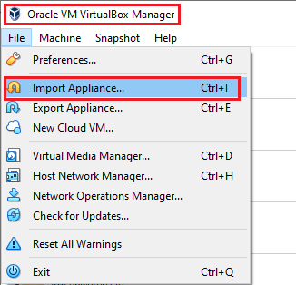
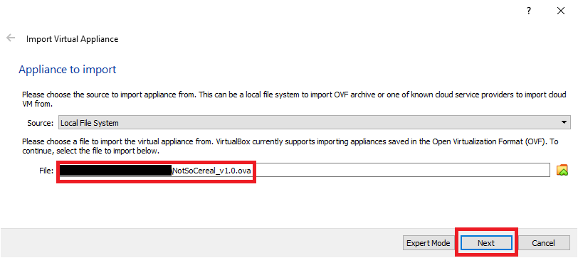
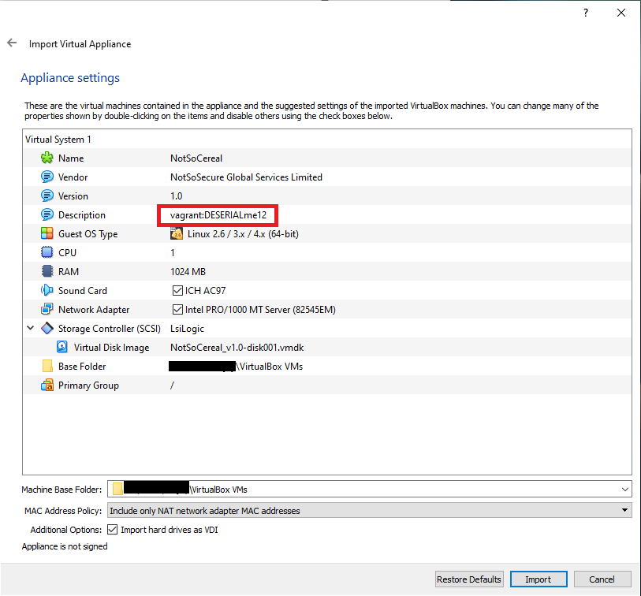
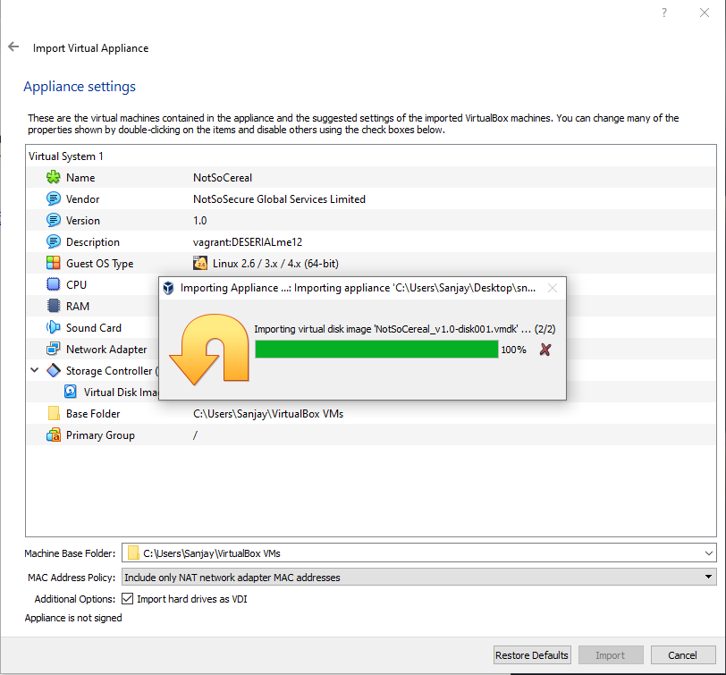
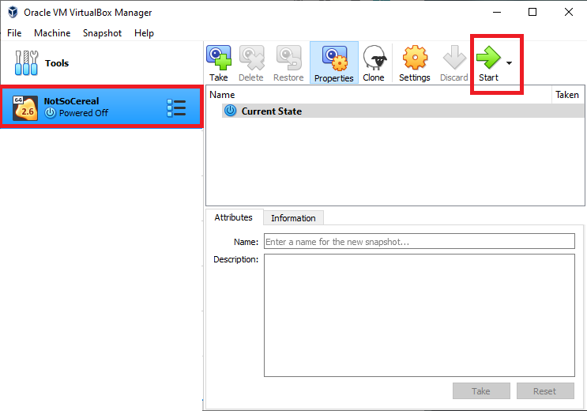
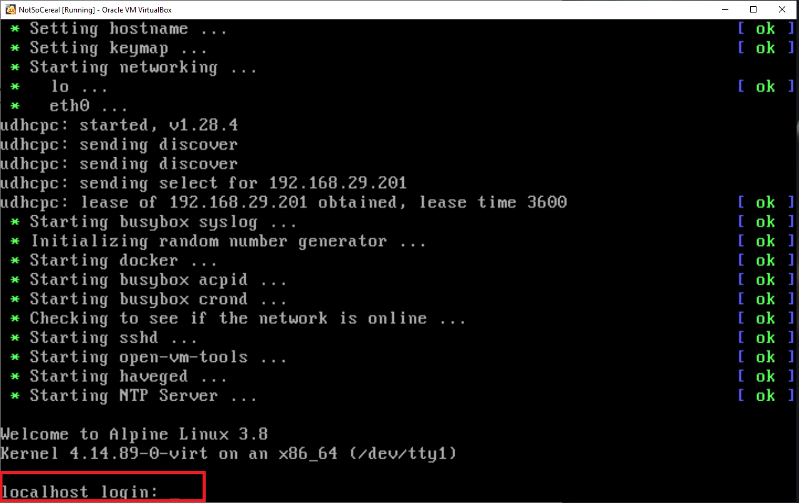
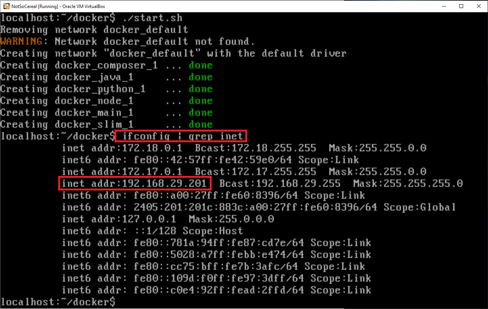
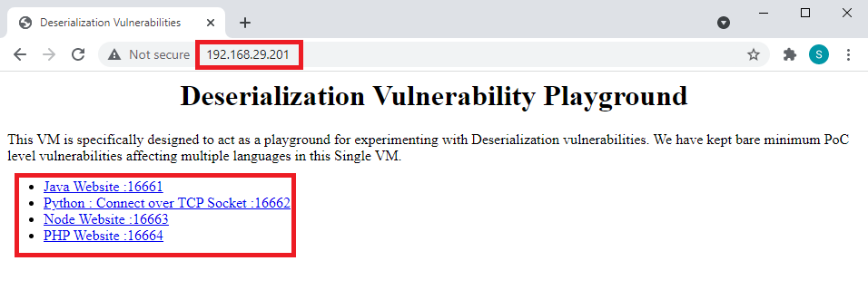

# Deployment Guide

**Step 1:**Download the OVA file and try to import it in Virtual Box using "File -> Import Applience..." option.

<br /> <br />

**Step 2:**Select the path of downloaded OVA file "NotSoCereal_v1.0.ova".

<br /> <br />

**Step 3:**Observe the credential in "Description" and click on Import button

<br /> <br />

**Step 4:**Import process.

<br /> <br />

**Step 5:**Click on "Start" button to start the NotSoCereal virtual box.

<br /> <br />

**Step 6:**Successfully loaded and ask for the credential.

<br /> <br />

**Step 7:**Enter the cerdential captured in **Step 3** and execute the following command to start the docker of the vulnerable application.
```
cd docker
./start.sh
```

<br /> <br />

**Step 8:**Captured the assigned IP Address of eth0 interface.

<br /> <br />

**Step 9:**Access the application using IP Address.

<br /> <br />