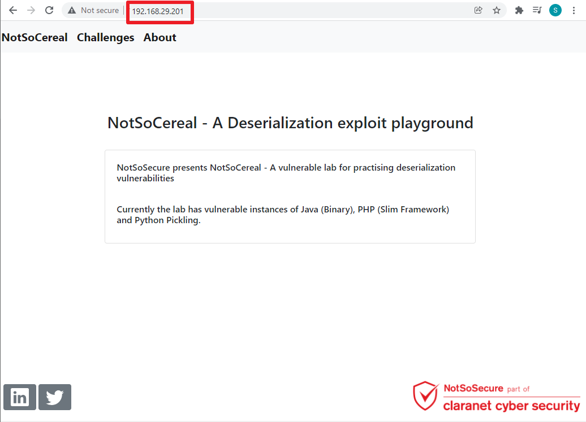

# Deployment Guide

**Step 1:** Download the OVA file and try to import it in Virtual Box using "File -> Import Appliance" option.<br />
<kbd>  </kbd>
<br /> <br />

**Step 2:** Select the path of downloaded OVA file "NotSoCereal_v1.0.ova".<br />
<kbd>  </kbd>
<br /> <br />

**Step 3:** Observe the credential in "Description" and click on Import button.<br />
<kbd>  </kbd>
<br /> <br />

**Step 4:** Import process.<br />
<kbd>  </kbd>
<br /> <br />

**Step 5:** Click on "Start" button to start the NotSoCereal virtual box.<br />
<kbd>  </kbd>
<br /> <br />

**Step 6:** Virtual Box will start and ask for credentials.<br />
<kbd>  </kbd>
<br /> <br />

**Step 7:** Enter the credentials captured in **Step 3** and execute the following command to start the docker of the vulnerable applications.<br />
```
cd docker
./start.sh
```
<kbd>  </kbd>
<br /> <br />

**Step 8:** Capture the assigned IP Address of "eth0" interface.<br />
<kbd>  </kbd>
<br /> <br />

**Step 9:** Access the application using IP Address.<br />
<kbd>  </kbd>
<br /> <br />